# Line Sheet Updater

A desktop tool that rewrites the sales figures printed on a wholesale line sheet,
one style at a time, and asks a person to check every one.

Built for a cashmere wholesaler in New England. In production.

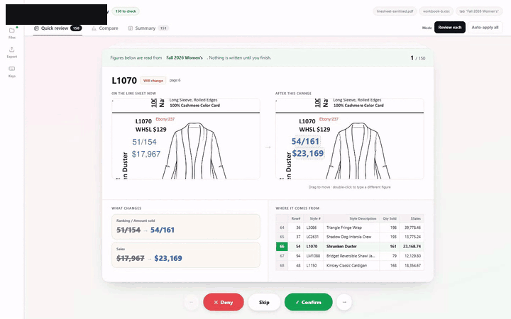

> The screenshots and the recording below are from the real tool running on the
> real document, with the client's name, mark and letterhead painted out. The
> figures are theirs and are left unattributed. Nothing here identifies them.

---

## The problem

A line sheet is the catalogue a wholesale buyer orders from. Every garment on it carries a
rank, the units it sold, and what it took in dollars, printed in blue beside the sketch.

Those figures go stale the moment sales move. The line sheet is an InDesign export with no
form fields, so the numbers aren't data sitting in a cell somewhere; they're drawing
instructions, baked into the page next to the artwork. Updating them meant opening the PDF
in Acrobat and retyping by hand: two figures a style, a hundred and fifty-three styles, sixteen
pages, every time the sales report was regenerated.

The constraint that shaped everything else: **a plausible wrong number on a sales document
is worse than a missing one.** Nothing throws an error. It just prints the wrong figure
beside the wrong sweater, and a buyer orders against it.

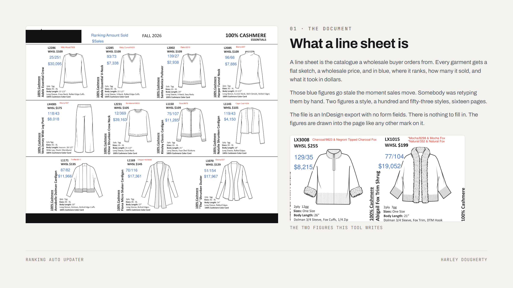

## What it does

You give it two files. Last season's line sheet, and the workbook the new figures live in.

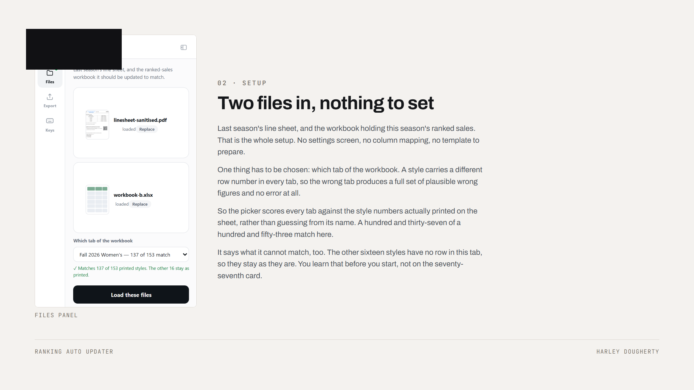

It works out which style on the page owns which figure, then brings each change up as a
card: the real cell as it prints today, the same cell with the new figures set into it, and
the workbook row they were read from. Enter confirms, D denies, S skips. Nothing is written
until you finish, and the file you loaded is never touched.

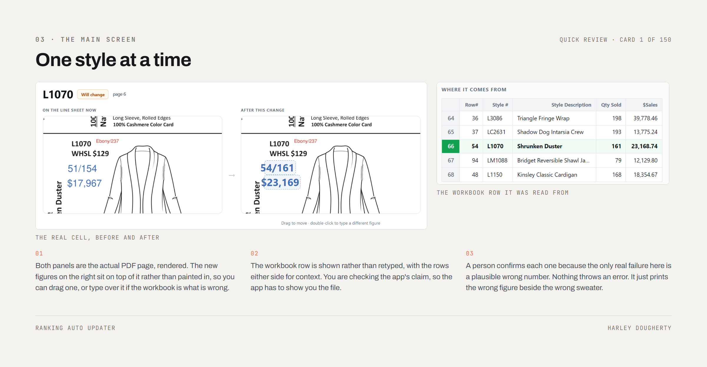

There are two speeds. Review each, or auto-apply the lot when you already trust the source.

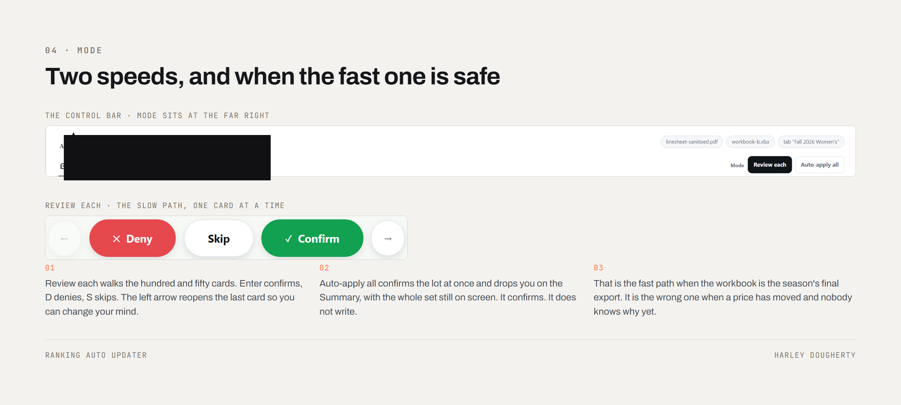

## Compare

Before it draws a single chart, the Compare tab answers four questions in a sentence each:
did the season grow, which styles moved, what do we charge, who carries the season. The
person doing this job has a deadline rather than a statistics degree.

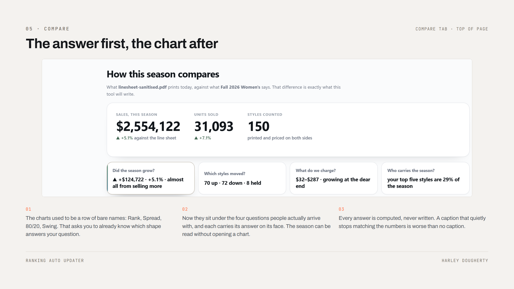

Thirteen chart views sit underneath. All hand-authored SVG: no chart library, no CDN, no
build step, so the whole review opens on a machine with nothing installed on it.

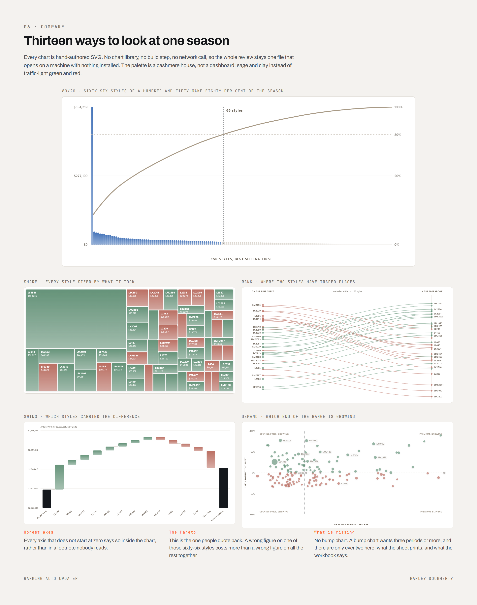

## Every style, and what happens to it

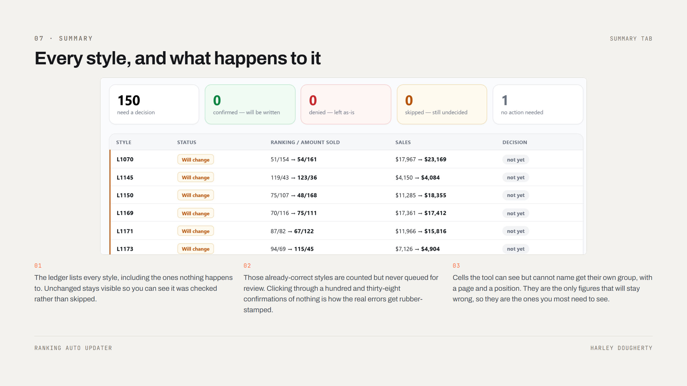

## Saving

Lossless throughout. Photographs are never downsampled. The save panel is the operating
system's own, not a browser download, because the person using this needs the file to land
in a folder they chose.

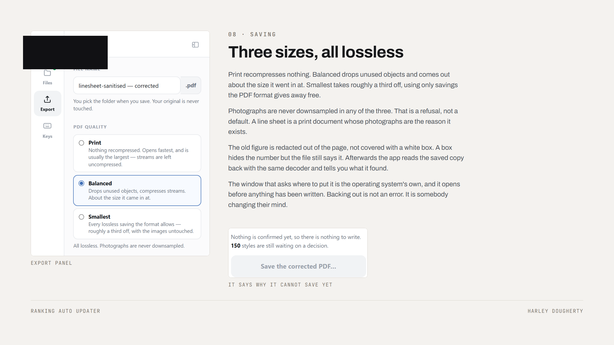

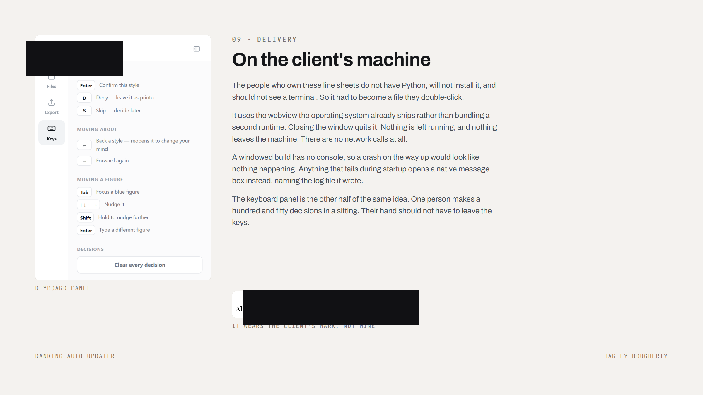

---

## How it works

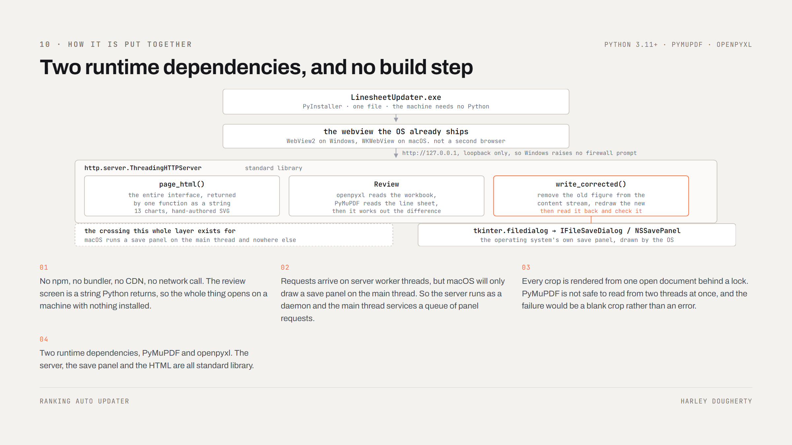

The whole thing is one Python process. It freezes to a single file with PyInstaller, draws its
window with the webview the operating system already ships, WebView2 on Windows and WKWebView on
macOS, then serves itself over loopback so Windows raises no firewall prompt.

There is no front end to build. `page_html()` returns the entire interface as a string, charts
included, so the review screen opens on a machine with nothing installed on it.

One crossing shaped the architecture: macOS will only draw a save panel on the process's main
thread, while requests arrive on server worker threads. So the server runs as a daemon and the
main thread services a queue of panel requests.

Three things make it harder than it sounds:

**The digits don't arrive as digits.** The exporter ships no ToUnicode CMap, so text comes
back as Coptic. Two glyph tables had to be reconstructed from the artwork before anything
could be read at all.

**Covering a number isn't changing it.** Paint a white rectangle over the old figure and the
page looks right while the file still says the wrong thing. Copy the page and the stale
number comes with it. The old text has to be removed from the content stream, then the new
figure redrawn at the same size, baseline, colour and right-edge alignment.

**A text box is the font's line box, not the ink.** Redaction removes a whole character for
any part of it a rectangle touches, so an early version took six characters off the front of
a neighbouring garment description. A rectangle now retreats from any line it merely grazes,
giving up padding rather than ink.

Every saved file is read back with the same decoder and checked figure by figure.

## Code

`code/` holds the three modules that carry the interesting parts, lifted from the private
repo:

| File | What it does |
| --- | --- |
| [`writer.py`](code/writer.py) | The PDF surgery. Redaction, redraw, and read-back verification |
| [`plan.py`](code/plan.py) | Working out what actually changes, and what must never be written |
| [`sales.py`](code/sales.py) | Reading the workbook, including the columns that get renamed between seasons |

The comments are the documentation. Most constants carry a paragraph explaining the failure
they prevent, with the measurement behind the number.

## Built with

Python 3.11+ · PyMuPDF · openpyxl · hand-written HTML/CSS/SVG served from localhost ·
tkinter for the native save panel · pywebview and PyInstaller for the desktop build ·
GitHub Actions for the tagged release build

## A note on the screenshots

They run on a **sanitised** copy of a real line sheet. The layout, the flats, the style
numbers and the typography are genuine; the blue ranking and sales figures were rewritten to
invented ones, written by this tool run against a scrambled workbook. No real client sales data
appears anywhere in this repository.

---

Built for a client and still in production, so the application source stays private and this
repository carries no licence: the three modules and the images here are published to be
read, not reused. Ask me if you want to do something with any of it —
[harleydoughertyart@gmail.com](mailto:harleydoughertyart@gmail.com).
